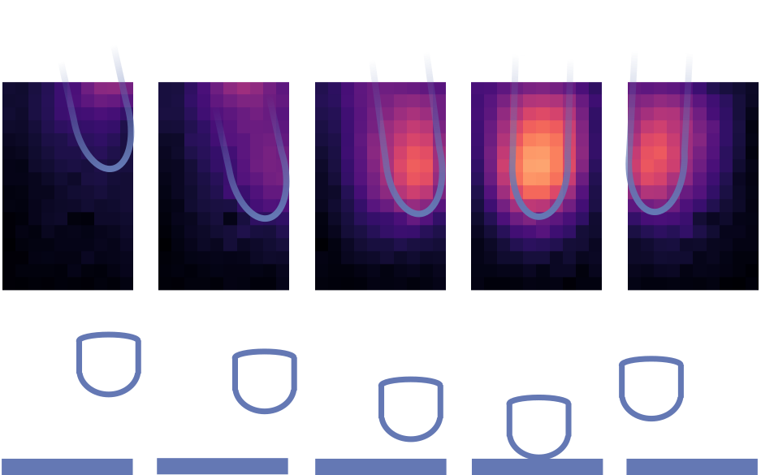

# CIX 2025: Forward and Inverse Modelling in HCI

* 9th International Computational Interaction Summer School 2025: Sorbonne University, Paris, France.
* Notes on forward and inverse modelling in HCI.
* **John H. Williamson**, *University of Glasgow*.

# Installation
* Clone the repo.
* If `uv` is not installed, `pip install uv`.
* `uv run jupyter notebook 01_Introduction.ipynb`should get you started
* Try `uv run src/key_demo.py` to check the keyboard tracking demo is working.

# Acknowledgements

Supported by the project **Designing Interaction Freedom via Active Inference (DIFAI)**, ERC Advanced Grant proposal 101097708, funded by the UK Horizon guarantee scheme as EPSRC project EP/Y029178/1.